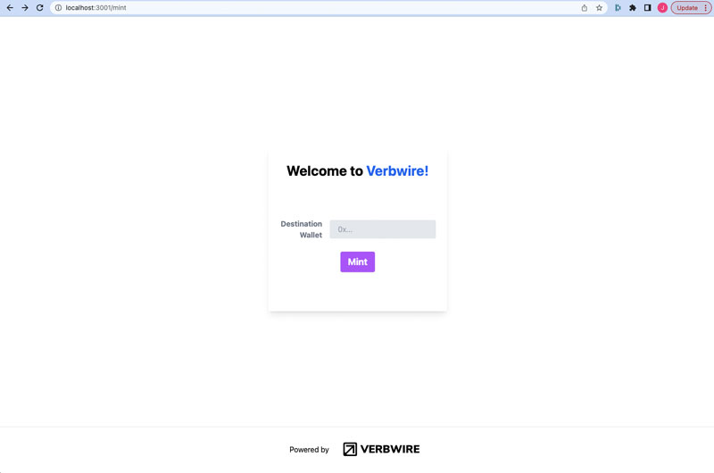

# Verbwire Simple Smart Contract Example

This project demonstrates how to easily mint from a smart contract deployed on the Verbwire platform. This project utilizes Nextjs as well as Tailwind CSS. Additionally it implements the Verbwire Javascript SDK in a best practices way (i.e. keeping private keys isolated from user interactions by leveraging server side calls).

## Requirements
1. You'll need a Verbwire API Key. You can get a free API key [HERE](https://www.verbwire.com/auth/register)

## Steps to run program locally
1. In the env file, .env, input your Verbwire API key under the VERBWIRE_API_KEY element

2. Input the contract address under the CONTRACT_ADDRESS element. If you don't already have a contract address, you can either deploy via the API or use the Verbwire dashboard to click to deploy.

You can find a video demonstration of the latter example [HERE](https://www.youtube.com/watch?v=qeKoEA8Wn64)

3. Replace the CHAIN variable in the .env to specify which blockchain you'd like to use. Note this chain must match the chain where the smart contract is deployed.

4. From you command prompt, type in the following to install node modules including the verbwire SDK

```bash
npm i 
```


5. From you command prompt, type in the following to start the program

```bash
npm run dev
```

6. Open your browser and go to localhost:3000/mint to mint a local image to the blockchain

7. This project uses a local file called VerbwireIconBlack.png for the image (located in the assets folder). You can replace this with any image you'd like to mint to the blockchain. The /pages/api/mint.js references this file and can be changed as desired.

8. Any data can be minted to the blockchain. The /pages/api/mint.js file has an example call via the Verbwire SDK populating the data field. This is what shows up as metadata on various platforms. If you would like the data to be viewable on common platforms like Opensea, then please follow the format included:

```js
data: "[{\"trait_type\":\"TraitType1\",\"value\":\"TraitValue1\"},{\"trait_type\":\"TraitType2\",\"value\":\"TraitValue2\"}]",
```

## Screenshots


<div align="center">
    
</div>
